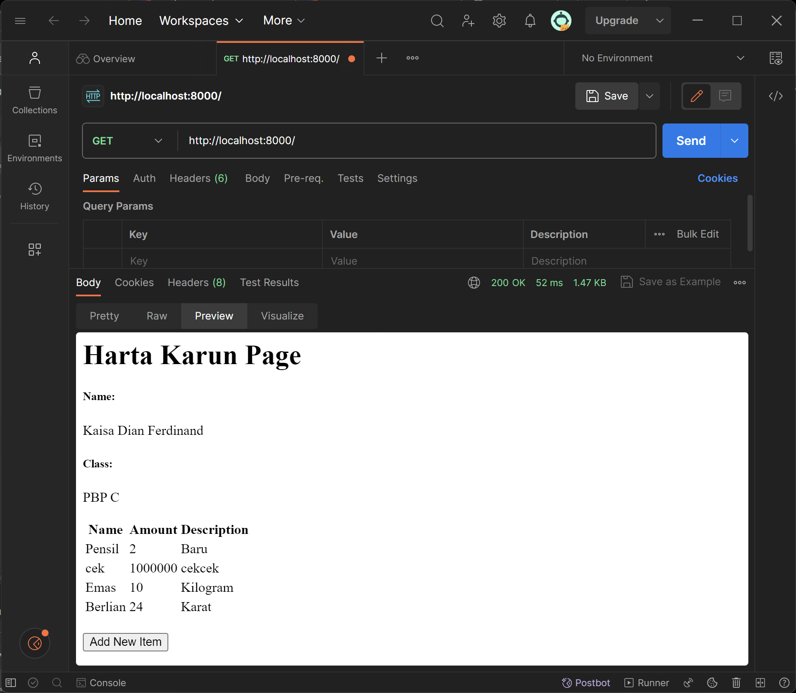
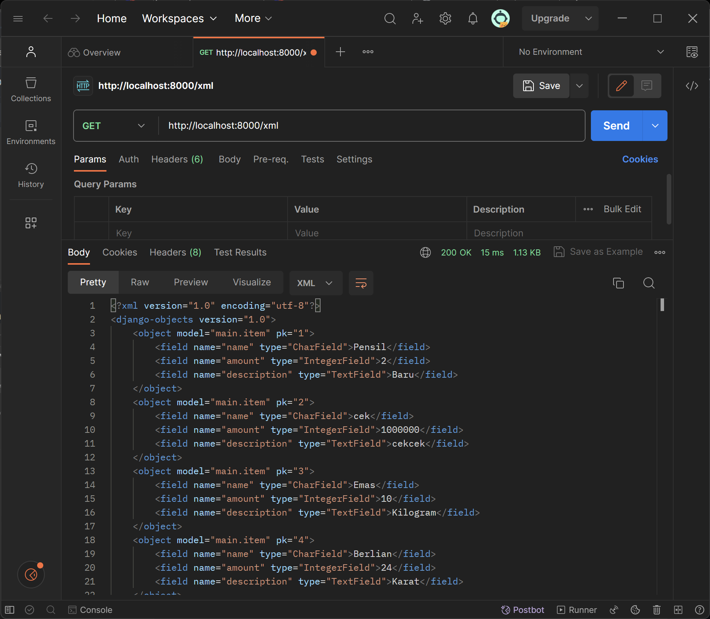
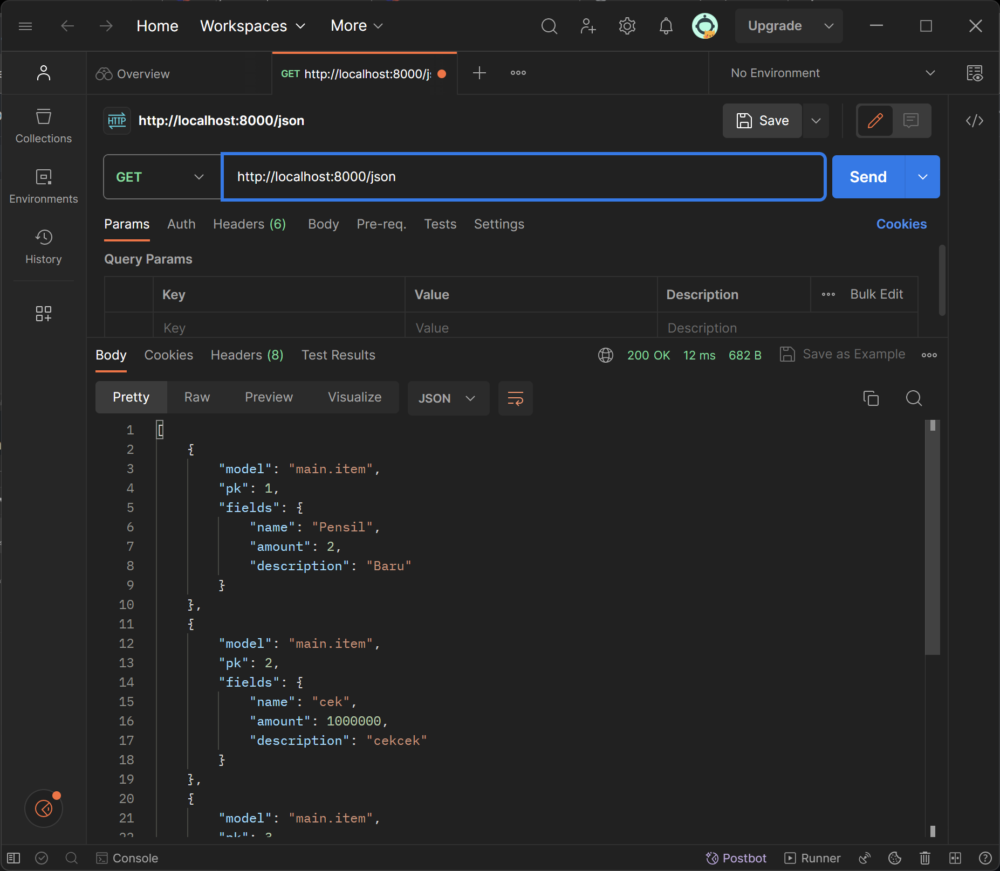
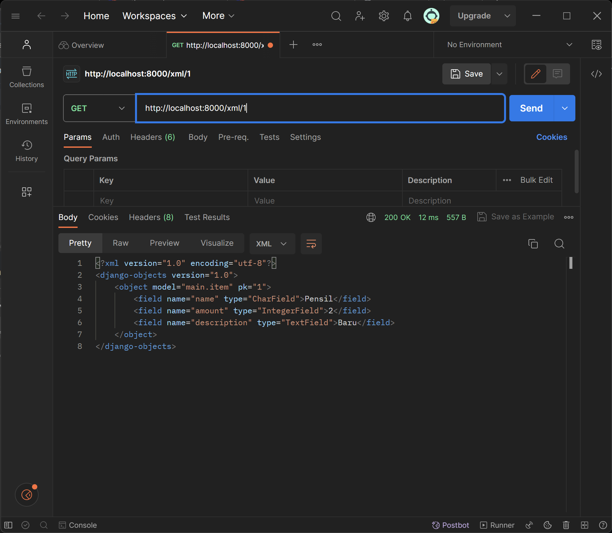
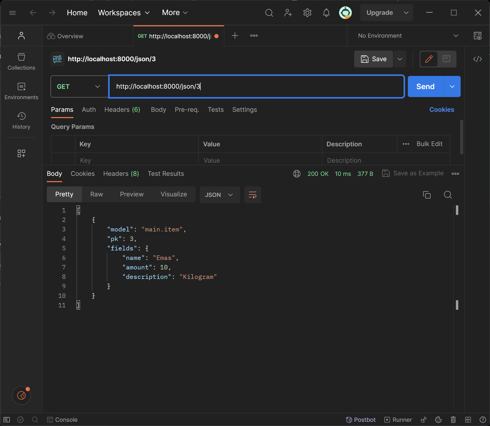

**Nama   : Kaisa Dian Ferdinand**

**NPM    : 2206816494**

**Kelas  : PBP C**

# TUGAS 2

### 1. Jelaskan bagaimana cara kamu mengimplementasikan checklist di atas secara step-by-step (bukan hanya sekadar mengikuti tutorial).
a. **Membuat sebuah proyek Django baru**:
Pada direktori yang telah saya tentukan, Saya membuat proyek Django baru yang bernama "harta_karun". Saya membuat proyek tersebut dengan membuka terminal di dalam direktori tersebut dan menjalankan kode :  
```python 
django-admin startporject harta_karun
```
b. **Membuat aplikasi main pada proyek tersebut**:
Saya membuat aplikasi main pada direktori proyek "harta_karun" dan menjalankan kode :  
```python
python manage.py startapp main
```
c. **Melakukan routing pada proyek agar dapat menjalankan aplikasi main**:
Setelah membuat aplikasi main, saya menambahkan aplikasi tersebut pada `settings.py` di direktori proyek supaya aplikasi terdaftar pada proyek tersebut.  
```python
INSTALLED_APPS = [
    'django.contrib.admin',
    'django.contrib.auth',
    'django.contrib.contenttypes',
    'django.contrib.sessions',
    'django.contrib.messages',
    'django.contrib.staticfiles',
    'main',
]
```
d. **Membuat model pada aplikasi dengan nama `Item` dengan atribut sebagai berikut**:
- `name` dengan tipe `CharField`.  
 Atribut tersebut akan menjelaskan nama dari model.
- `amount` dengan tipe `IntegerField`.  
 Atribut tersebutakan menjelaskan total banyak item yang dapat dikoleksi.
- `description` dengan tipe `TextField`.  
 Atribut tersebut mendeskripsikan item tersebut.

Setelah membuat model tersebut, Saya melakukan migrasi untuk menyimpan model dan atributnya pada database dengan menjalankan kode di bawah ini pada terminal.  
~~~
python manage.py makemigrations
python manage.py migrate
~~~
e. **Membuat fungsi `show_main` pada `views.py` untuk dikembalikan ke dalam sebuah template HTML**:
 Pada `views.py`, Saya membuat fungsi yang nantinya akan memberikan data kepada `main.html`.
```python
from django.shortcuts import render

# Create your views here.
def show_main(request):
    context = {
        'name': 'Kaisa Dian Ferdinand',
        'class': 'PBP C'
    }

    return render(request, "main.html", context)
```
Pada fungsi, Saya membuat `context` yang merupakan sebuah dictionary. Keys dari dictionary tersebut akan menjadi variable yang dapat digunakan pada `main.html` dan values merupakan datanya.

f. **Membuat routing pada `urls.py`**:
Pada langkah ini Saya membuat `urls.py` pada direktori aplikasi `main` dan gunanya untuk memetakan fungsi yang telah dibuat pada `views.py` tadi.
```python
from django.urls import path
from main.views import show_main

app_name = 'main'

urlpatterns = [
    path('', show_main, name='show_main'),
]
```
Di dalam fungsi `path`, saya membuat parameter pertama sebagai `''` supaya halaman aplikasi tersebut muncul pada halaman utama localpath. Parameter kedua berisikan fungsi yang telah dibuat pada `views.py` dan parameter `name` adalah untuk pengakses fungsi tersebut.

g. **Melakukan deployment ke Adaptable**:
Untuk menerapkan aplikasi yang telah saya kembangkan sehingga teman-teman dapat mengaksesnya melalui Internet, saya melakukan langkah-langkah berikut:
1. Pertama, saya membuat akun **Adaptable.io** menggunakan akun GitHub yang telah saya gunakan untuk membuat proyek harta_karun.
2. Setelah berhasil login, saya memilih tombol `New App` dan opsi `Connect an Existing Repository`. 
3. Hubungkan **Adaptable.io** dengan GitHub dan pilih `All Repositories` selama proses instalasi.
4. Selanjutnya, saya pilih repositori proyek `harta_karun` sebagai dasar aplikasi yang akan  di-deploy. Saya memastikan juga untuk memilih branch yang akan digunakan sebagai branch deployment.
5. Untuk template deployment, saya memilih `Python App Template`.
6. Pilih jenis basis data yang akan digunakan. Dalam kasus ini, saya memilih `PostgreSQL`.
7. Saya pastikan versi Python sesuai dengan spesifikasi aplikasi harta_karun. Untuk memeriksanya, saya aktifkan virtual environment dan gunakan perintah `python --version`.
8. Pada bagian `Start Command`, saya masukkan perintah `python manage.py migrate && gunicorn harta_karun.wsgi`.
9. Selanjutnya, saya memasukkan nama aplikasi, yang juga akan menjadi nama domain situs web aplikasi Anda.
10. Terakhir, saya mencentang opsi `HTTP Listener on PORT`, lalu klik `Deploy App` untuk memulai proses deployment aplikasi.

Dengan mengikuti langkah-langkah di atas, aplikasi saya akan siap untuk diakses oleh teman-teman Anda melalui Internet.
  
### 2. Buatlah bagan yang berisi request client ke web aplikasi berbasis Django beserta responnya dan jelaskan pada bagan tersebut kaitan antara urls.py, views.py, models.py, dan berkas html. 

- `urls.py` : Ketika User melakukan request kepada website, maka request tersebut akan diteruskan kepada fungsi yang sesuai pada halaman itu dan terdaftar dalam urlpatterns halaman tersebut. Pada halaman utama website ini, request akan diarahkan ke fungsi `show_main` yang terletak di dalam file `views.py`.
- `views.py` : Di dalam berkas `views.py`, terdapat sebuah fungsi bernama `show_main` yang menerima parameter `request` untuk menerima permintaan dari pengguna. Dalam fungsi ini, kita menggunakan `context`, yang merupakan sebuah kamus (dictionary), untuk menyediakan data yang akan ditampilkan di berkas `main.html`. Fungsi ini memilih berkas `main.html` untuk menampilkan data yang diperoleh dari basis data kepada pengguna nantinya.
- `models.py` : Pada aplikasi ini, semua model yang digunakan dibuat dalam bentuk class di file yang bersangkutan. Dalam aplikasi utama ini, ada pembuatan model yang disebut **Item** yang memiliki beberapa atribut. Di dalam file `views.py`, dapat diciptakan beberapa object seperti dictionary context dengan isi nama dan kelas, kemudian dikirim ke halaman `main.html`.
- `main.html` : Data yang diterima dari `views.py` akan ditampilkan pada file html ini dan dapat dilihat oleh User.

### 3. Jelaskan mengapa kita menggunakan virtual environment? Apakah kita tetap dapat membuat aplikasi web berbasis Django tanpa menggunakan virtual environment?
- **Virtual environment** digunakan dalam pengembangan aplikasi web berbasis Django untuk mengisolasi dependensi dan paket Python proyek secara lokal, menghindari konflik, mengontrol versi, memungkinkan portabilitas, menjaga kebersihan pengembangan, dan meningkatkan keamanan. Meskipun kita dapat membuat aplikasi Django tanpa virtual environment, tetapi sangat disarankan untuk menggunakan alat ini karena jika meng-install semua package pada local environment, bisa terjadi tabrakan ketika kita sedang bekerja pada berbagai proyek yang berbeda.

### 4. Jelaskan apakah itu MVC, MVT, MVVM dan perbedaan dari ketiganya.
**MVC**, **MVT**, dan **MVVM** adalah tiga pola desain (design pattern) yang digunakan dalam pengembangan perangkat lunak untuk mengorganisasi kode dan logika aplikasi. Masing-masing memiliki tujuan dan struktur yang berbeda. Berikut adalah penjelasan singkat tentang ketiganya beserta perbedaan utama:

a. **MVC (Model-View-Controller)**:
   - **Model**: Mewakili data dan logika bisnis dalam aplikasi. Ini adalah bagian yang bertanggung jawab untuk mengelola data, menghitung, dan mengolah informasi.
   - **View**: Bertanggung jawab untuk menampilkan data dari Model ke pengguna akhir. View berinteraksi dengan pengguna dan menampilkan informasi secara visual.
   - **Controller**: Bertindak sebagai perantara antara Model dan View. Ini mengontrol aliran data dan logika aplikasi. Ketika pengguna berinteraksi dengan View, Controller meresponsnya dengan mengubah Model jika diperlukan.

   **Perbedaan utama**:
   - MVC adalah pola desain yang terpusat pada pemisahan tanggung jawab antara Model, View, dan Controller. Ini sering digunakan dalam pengembangan aplikasi web dan desktop.
   - MVC tidak mengatur secara ketat bagaimana komunikasi antara komponen harus terjadi, sehingga dapat bervariasi dalam implementasinya.

b. **MVT (Model-View-Template)**:
   - **Model**: Sama dengan dalam MVC, mewakili data dan logika bisnis.
   - **View**: Menampilkan data dan mengatur tampilan.
   - **Template**: Bertanggung jawab untuk menghasilkan tampilan dinamis berdasarkan Model. Ini mirip dengan View dalam MVC, tetapi tugasnya lebih fokus pada tampilan.

   **Perbedaan utama**:
   - MVT adalah varian dari MVC yang sering digunakan dalam kerangka kerja Django, yang sangat populer dalam pengembangan web dengan bahasa pemrograman Python.
   - Perbedaan utama adalah penggunaan "Template" yang memisahkan tampilan dari kode HTML dalam konteks MVT.

c. **MVVM (Model-View-ViewModel)**:
   - **Model**: Sama seperti dalam MVC dan MVT, mewakili data dan logika bisnis.
   - **View**: Mirip dengan View dalam MVC dan MVT, menampilkan data ke pengguna.
   - **ViewModel**: Bertindak sebagai perantara antara Model dan View. ViewModel berisi logika presentasi dan transformasi data. Ini memungkinkan View untuk menjadi lebih terpisah dari Model, sehingga lebih mudah untuk mengatur tampilan berdasarkan data.

   **Perbedaan utama**:
   - MVVM adalah pola desain yang sering digunakan dalam pengembangan aplikasi berbasis platform, terutama dalam pengembangan aplikasi berbasis teknologi seperti WPF (Windows Presentation Foundation) dan Xamarin.
   - ViewModel adalah komponen kunci yang membedakan MVVM dari MVC dan MVT. Ini memungkinkan tampilan untuk lebih mandiri dalam memproses dan menampilkan data.

Pilihan antara MVC, MVT, dan MVVM tergantung pada bahasa pemrograman, platform, dan kebutuhan aplikasi. Semua pola desain ini bertujuan untuk meningkatkan pemeliharaan, skalabilitas, dan struktur dalam pengembangan perangkat lunak.

### ----------------------------------------------------------------------------------------------------------------

# TUGAS 3

### 1. Apa perbedaan antara form POST dan form GET dalam Django?
a. `GET` umumnya dipakai untuk operasi baca saja yang aman, di mana data dapat terlihat di `URL` dan dibagikan dengan mudah. `GET` menggabungkan data yang dikirim menjadi **string**, lalu menggunakannya untuk membuat `URL` yang berisi alamat tujuan pengiriman data, beserta kunci dan nilai data. Sementara `POST` digunakan untuk operasi yang mengubah status server atau melibatkan data yang sensitif dan tidak boleh tampil di `URL`. `POST` memiliki proteksi `CSRF Django` yang memberikan kontrol lebih terhadap akses.

b.  Penggunaan `POST` sangat sesuai untuk formulir `login`, karena umumnya memerlukan **kata sandi**. Karena kata sandi adalah informasi sensitif, sebaiknya tidak ditampilkan dalam `URL`. Sedangkan metode `GET` sangat cocok untuk formulir pencarian web, karena `URL` terkait dengan permintaan `GET` bisa dengan mudah di-***bookmark***, dibagikan, atau digunakan kembali.

### 2. Apa perbedaan utama antara XML, JSON, dan HTML dalam konteks pengiriman data?
a. **HTML (HyperText Markup Language)** berfungsi sebagai dasar dalam pengembangan web dan digunakan untuk menentukan struktur halaman. Fungsinya adalah menjelaskan tata letak data pada sebuah halaman web. HTML digunakan oleh browser web untuk menginterpretasikan dan merangkai teks, gambar, serta konten lainnya menjadi halaman web yang dapat dilihat atau didengar.

b. **JSON (JavaScript Object Notation)** dipergunakan untuk penyimpanan dan pengiriman data. Ini merupakan metode untuk menggambarkan objek dengan format pertukaran data berbasis teks yang terdiri dari pasangan key-value. File JSON jauh lebih mudah dibaca daripada XML karena lebih singkat.

c. **XML (eXtensible Markup Language)** digunakan untuk merepresentasikan data dengan cara yang dapat dipahami oleh mesin. XML adalah bahasa markup yang bersifat fleksibel dan memungkinkan definisi struktur data yang kompleks. XML menggunakan tag untuk menggambarkan item data.

### 3. Mengapa JSON sering digunakan dalam pertukaran data antara aplikasi web modern?
Pada umumnya, **JSON** digunakan untuk mengirim data melalui koneksi internet dan untuk proses serialisasi. **JSON** memiliki peran utama dalam mengirim data antara aplikasi web dan server. **JSON** menjadi populer di dunia ***code programming*** dan layanan web karena mampu meningkatkan pertukaran data dan efisiensi hasil layanan web. **JSON** adalah format data berbasis teks yang ringan dan mudah diurai, sehingga tidak memerlukan kode tambahan untuk parsing.

### 4. Jelaskan bagaimana cara kamu mengimplementasikan checklist di atas secara step-by-step (bukan hanya sekadar mengikuti tutorial).
#### 1. Membuat input form untuk menambahkan objek model pada app sebelumnya. 
Untuk membuat form, agar aplikasi saya bisa digunakan untuk menginput Item berikut adalah step-stepnya:
a. Membuat file `forms.py` di direktori main
Isi file tersebut adalah import ModelForm dari django.forms dan import Item dari main.models.
Lalu, saya membuat class ItemForm yang menerima parameter ModelForm, di dalamnya terdapat class Meta dengan `fields` = `name`, `amount`, dan `description"`.

b. Menambahkan import di file `views.py` yang berada di folder main.
Saya menambahkan:
```python
import HttpResponseRedirect, ProductForm, dan reverse.
```

c. Membuat fungsi `create_item` di dalam file `views.py` tersebut.
  Fungsi ini bertujuan agar bisa membuat formulir yang dapat menambahkan data produk ke dalam database secara otomatis ketika pengguna mengirimkan data melalui formulir.

d. Mengubah fungsi `show_main` untuk mengambil semua object Item yang ada di database
  Caranya dengan menambahkan `'items': items` di dalam variable `context`.

e. Mengimport fungsi `create_item` ke file `urls.py` di dalam folder main.
  Saya menambahkan import `create_item` dari `main.views`.

f. Menambahkan path url yang sesuai
  Saya membuat path baru
  ```python
  path('create-item', create_item, name='create_item'),
  ```

g. Membuat file HTML baru bernama `create_item.html` pada direktori main dalam folder templates.
  Saya membuat tabel untuk menunjukkan data yang tersimpan di database.

h. Menambahkan kode di file `main.html` untuk menampilkan data item yang telah di input
  Untuk melakukan hal tersebut, saya menambahkan kode:
```html
    <style>
        .special-paragraph {
            margin-top: 45px;
            margin-bottom: 10px;
        }

        table {
            width: 100%;
            border-collapse: collapse;
        }
    
        th, td {
            border: 1px solid #dddddd;
            text-align: left;
            padding: 8px;
        }
    
        tr:nth-child(even) {
            background-color: #f2f2f2;
        }
    </style>

    <p class="special-paragraph">Kamu menyimpan <strong>{{total}}</strong> item pada aplikasi ini</p>

    <table>
        <tr>
            <th>Name</th>
            <th>Amount</th>
            <th>Description</th>
        </tr>
    
         Berikut cara memperlihatkan data item di bawah baris ini 
    
        
            <tr>
                <td>{{item.name}}</td>
                <td>{{item.amount}}</td>
                <td>{{item.description}}</td>
            </tr>
        
    </table>
```
Lalu, saya membuaat button untuk menambahkan item dan diarahkan ke url create_item.
```html
    <a href="">
        <button>
            Add New Item
        </button>
    </a>
```

#### 2. Menambahkan fungsi `views` untuk melihat objek yang sudah ditambahkan dalam format HTML, XML, JSON, XML by ID, dan JSON by ID.
Saya menambahkan kode berikut dalam file `views.py` yang berada di main.
```python
def show_main(request):
    items = Item.objects.all()

    context = {
        'name': 'Kaisa Dian Ferdinand', # Nama kamu
        'class': 'PBP C', # Kelas PBP kamu
        'items': items,
        'total': items.count()
    }

    return render(request, "main.html", context)

def show_xml(request):
    data = Item.objects.all()
    return HttpResponse(serializers.serialize("xml", data), content_type="application/xml")

def show_json(request):
    data = Item.objects.all()
    return HttpResponse(serializers.serialize("json", data), content_type="application/json")

def show_xml_by_id(request, id):
    data = Item.objects.filter(pk=id)
    return HttpResponse(serializers.serialize("xml", data), content_type="application/xml")

def show_json_by_id(request, id):
    data = Item.objects.filter(pk=id)
    return HttpResponse(serializers.serialize("json", data), content_type="application/json")
```
Dengan lima fungsi views ini, kita dapat melihat objek yang sudah ditambahkan dalam format HTML, XML, JSON, XML by ID, dan JSON by ID di aplikasi Django `harta_karun`.

#### 3. Membuat routing URL untuk masing-masing views yang telah ditambahkan pada poin 2.
Routing URL memungkinkan aplikasi untuk menghubungkan URL tertentu dengan view yang sesuai. Ketika user mengakses URL tertentu, Django akan menggunakan routing URL untuk menentukan view yang harus dipanggil.
Pada file `urls.py` pada direktori main, saya menambahkan kode berikut:
```python
urlpatterns = [
    path('', show_main, name='show_main'),
    path('create-item', create_item, name='create_item'),
    path('xml/', show_xml, name='show_xml'), 
    path('json/', show_json, name='show_json'), 
    path('xml/<int:id>/', show_xml_by_id, name='show_xml_by_id'),
    path('json/<int:id>/', show_json_by_id, name='show_json_by_id'), 
]
```

# POSTMAN

### ***Screenschot*** Postman (HTML)


### ***Screenschot*** Postman (XML)


### ***Screenschot*** Postman (JSON)


### ***Screenschot*** Postman (XML ***by*** ID)


### ***Screenschot*** Postman (JSON ***by*** ID)
