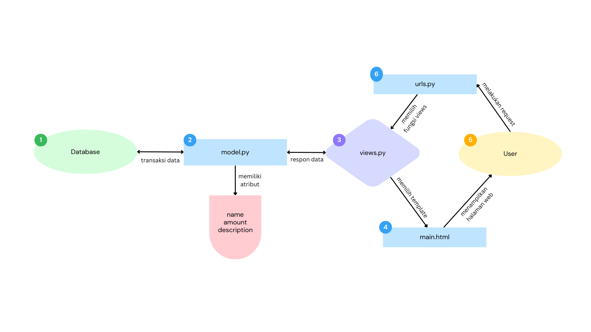

**Nama   : Kaisa Dian Ferdinand**

**NPM    : 2206816494**

**Kelas  : PBP C**

### Web Adaptable:
~~~
https://harta-karun.adaptable.app/main
~~~

### 1. Jelaskan bagaimana cara kamu mengimplementasikan checklist di atas secara step-by-step (bukan hanya sekadar mengikuti tutorial).
a. **Membuat sebuah proyek Django baru**:
Pada direktori yang telah saya tentukan, Saya membuat proyek Django baru yang bernama "harta_karun". Saya membuat proyek tersebut dengan membuka terminal di dalam direktori tersebut dan menjalankan kode :  
~~~  
django-admin startporject harta_karun
~~~  
b. **Membuat aplikasi main pada proyek tersebut**:
Saya membuat aplikasi main pada direktori proyek "harta_karun" dan menjalankan kode :  
~~~
python manage.py startapp main
~~~
c. **Melakukan routing pada proyek agar dapat menjalankan aplikasi main**:
Setelah membuat aplikasi main, saya menambahkan aplikasi tersebut pada `settings.py` di direktori proyek supaya aplikasi terdaftar pada proyek tersebut.  
~~~
INSTALLED_APPS = [
    'django.contrib.admin',
    'django.contrib.auth',
    'django.contrib.contenttypes',
    'django.contrib.sessions',
    'django.contrib.messages',
    'django.contrib.staticfiles',
    'main',
]
~~~
d. **Membuat model pada aplikasi dengan nama `Item` dengan atribut sebagai berikut**:
- `name` dengan tipe `CharField`.  
 Atribut tersebut akan menjelaskan nama dari model.
- `amount` dengan tipe `IntegerField`.  
 Atribut tersebutakan menjelaskan total banyak item yang dapat dikoleksi.
- `description` dengan tipe `TextField`.  
 Atribut tersebut mendeskripsikan item tersebut.

Setelah membuat model tersebut, Saya melakukan migrasi untuk menyimpan model dan atributnya pada database dengan menjalankan kode di bawah ini pada terminal.  
~~~
python manage.py makemigrations
python manage.py migrate
~~~
e. **Membuat fungsi `show_main` pada `views.py` untuk dikembalikan ke dalam sebuah template HTML**:
 Pada `views.py`, Saya membuat fungsi yang nantinya akan memberikan data kepada `main.html`.
~~~
from django.shortcuts import render

# Create your views here.
def show_main(request):
    context = {
        'name': 'Kaisa Dian Ferdinand',
        'class': 'PBP C'
    }

    return render(request, "main.html", context)
~~~
Pada fungsi, Saya membuat `context` yang merupakan sebuah dictionary. Keys dari dictionary tersebut akan menjadi variable yang dapat digunakan pada `main.html` dan values merupakan datanya.

f. **Membuat routing pada `urls.py`**:
Pada langkah ini Saya membuat `urls.py` pada direktori aplikasi `main` dan gunanya untuk memetakan fungsi yang telah dibuat pada `views.py` tadi.
~~~
from django.urls import path
from main.views import show_main

app_name = 'main'

urlpatterns = [
    path('', show_main, name='show_main'),
]
~~~
Di dalam fungsi `path`, Saya membuat parameter pertama sebagai `''` supaya halaman aplikasi tersebut muncul pada halaman utama localpath. Parameter kedua berisikan fungsi yang telah dibuat pada `views.py` dan parameter `name` adalah untuk pengakses fungsi tersebut.
  
### 2. Buatlah bagan yang berisi request client ke web aplikasi berbasis Django beserta responnya dan jelaskan pada bagan tersebut kaitan antara urls.py, views.py, models.py, dan berkas html. 

- `urls.py` : Ketika User melakukan request kepada website, maka request tersebut akan diteruskan kepada fungsi yang sesuai pada halaman itu dan terdaftar dalam urlpatterns halaman tersebut. Pada halaman utama website ini, request akan diarahkan ke fungsi `show_main` yang terletak di dalam file `views.py`.
- `views.py` : Di dalam berkas `views.py`, terdapat sebuah fungsi bernama `show_main` yang menerima parameter `request` untuk menerima permintaan dari pengguna. Dalam fungsi ini, kita menggunakan `context`, yang merupakan sebuah kamus (dictionary), untuk menyediakan data yang akan ditampilkan di berkas `main.html`. Fungsi ini memilih berkas `main.html` untuk menampilkan data yang diperoleh dari basis data kepada pengguna nantinya.
- `models.py` : Pada aplikasi ini, semua model yang digunakan dibuat dalam bentuk class di file yang bersangkutan. Dalam aplikasi utama ini, ada pembuatan model yang disebut **Item** yang memiliki beberapa atribut. Di dalam file `views.py`, dapat diciptakan beberapa object seperti dictionary context dengan isi nama dan kelas, kemudian dikirim ke halaman `main.html`.
- `main.html` : Data yang diterima dari `views.py` akan ditampilkan pada file html ini dan dapat dilihat oleh User.

### 3. Jelaskan mengapa kita menggunakan virtual environment? Apakah kita tetap dapat membuat aplikasi web berbasis Django tanpa menggunakan virtual environment?
- **Virtual environment** digunakan dalam pengembangan aplikasi web berbasis Django untuk mengisolasi dependensi dan paket Python proyek secara lokal, menghindari konflik, mengontrol versi, memungkinkan portabilitas, menjaga kebersihan pengembangan, dan meningkatkan keamanan. Meskipun kita dapat membuat aplikasi Django tanpa virtual environment, tetapi sangat disarankan untuk menggunakan alat ini karena jika meng-install semua package pada local environment, bisa terjadi tabrakan ketika kita sedang bekerja pada berbagai proyek yang berbeda.

### 4. Jelaskan apakah itu MVC, MVT, MVVM dan perbedaan dari ketiganya.
**MVC**, **MVT**, dan **MVVM** adalah tiga pola desain (design pattern) yang digunakan dalam pengembangan perangkat lunak untuk mengorganisasi kode dan logika aplikasi. Masing-masing memiliki tujuan dan struktur yang berbeda. Berikut adalah penjelasan singkat tentang ketiganya beserta perbedaan utama:

a. **MVC (Model-View-Controller)**:
   - **Model**: Mewakili data dan logika bisnis dalam aplikasi. Ini adalah bagian yang bertanggung jawab untuk mengelola data, menghitung, dan mengolah informasi.
   - **View**: Bertanggung jawab untuk menampilkan data dari Model ke pengguna akhir. View berinteraksi dengan pengguna dan menampilkan informasi secara visual.
   - **Controller**: Bertindak sebagai perantara antara Model dan View. Ini mengontrol aliran data dan logika aplikasi. Ketika pengguna berinteraksi dengan View, Controller meresponsnya dengan mengubah Model jika diperlukan.

   **Perbedaan utama**:
   - MVC adalah pola desain yang terpusat pada pemisahan tanggung jawab antara Model, View, dan Controller. Ini sering digunakan dalam pengembangan aplikasi web dan desktop.
   - MVC tidak mengatur secara ketat bagaimana komunikasi antara komponen harus terjadi, sehingga dapat bervariasi dalam implementasinya.

b. **MVT (Model-View-Template)**:
   - **Model**: Sama dengan dalam MVC, mewakili data dan logika bisnis.
   - **View**: Menampilkan data dan mengatur tampilan.
   - **Template**: Bertanggung jawab untuk menghasilkan tampilan dinamis berdasarkan Model. Ini mirip dengan View dalam MVC, tetapi tugasnya lebih fokus pada tampilan.

   **Perbedaan utama**:
   - MVT adalah varian dari MVC yang sering digunakan dalam kerangka kerja Django, yang sangat populer dalam pengembangan web dengan bahasa pemrograman Python.
   - Perbedaan utama adalah penggunaan "Template" yang memisahkan tampilan dari kode HTML dalam konteks MVT.

c. **MVVM (Model-View-ViewModel)**:
   - **Model**: Sama seperti dalam MVC dan MVT, mewakili data dan logika bisnis.
   - **View**: Mirip dengan View dalam MVC dan MVT, menampilkan data ke pengguna.
   - **ViewModel**: Bertindak sebagai perantara antara Model dan View. ViewModel berisi logika presentasi dan transformasi data. Ini memungkinkan View untuk menjadi lebih terpisah dari Model, sehingga lebih mudah untuk mengatur tampilan berdasarkan data.

   **Perbedaan utama**:
   - MVVM adalah pola desain yang sering digunakan dalam pengembangan aplikasi berbasis platform, terutama dalam pengembangan aplikasi berbasis teknologi seperti WPF (Windows Presentation Foundation) dan Xamarin.
   - ViewModel adalah komponen kunci yang membedakan MVVM dari MVC dan MVT. Ini memungkinkan tampilan untuk lebih mandiri dalam memproses dan menampilkan data.

Pilihan antara MVC, MVT, dan MVVM tergantung pada bahasa pemrograman, platform, dan kebutuhan aplikasi. Semua pola desain ini bertujuan untuk meningkatkan pemeliharaan, skalabilitas, dan struktur dalam pengembangan perangkat lunak.